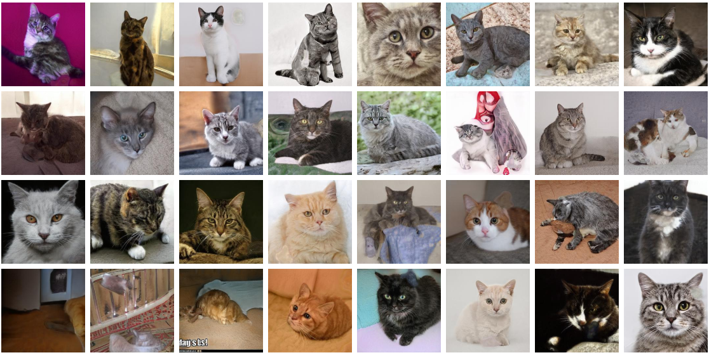

# These Cats Don't Exist

Generating Cat images using StyleGAN



## Create Bucket

```bash
aws s3 mb s3://thesecatsdonotexist.com
```

## Copy in Files

```bash
aws s3 cp index.html s3://thesecatsdonotexist.com/index.html
```

## Generate the Cats

```bash
jupyter-notebook notebooks/catgen.ipynb
```
