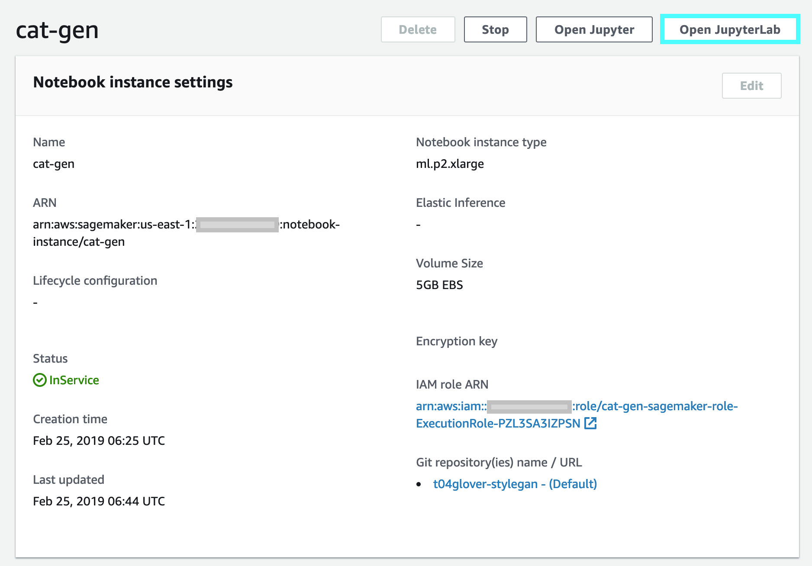
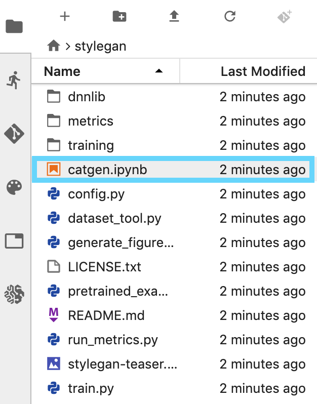
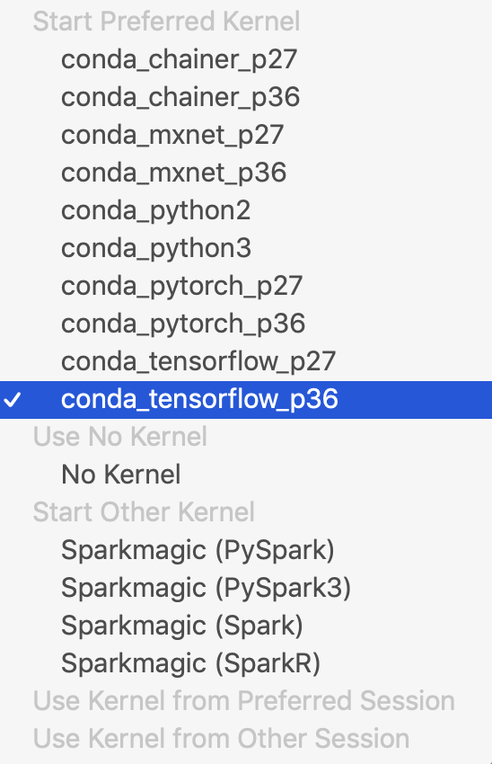
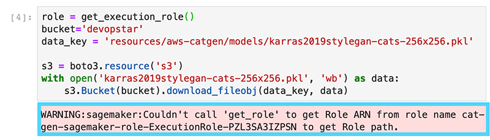
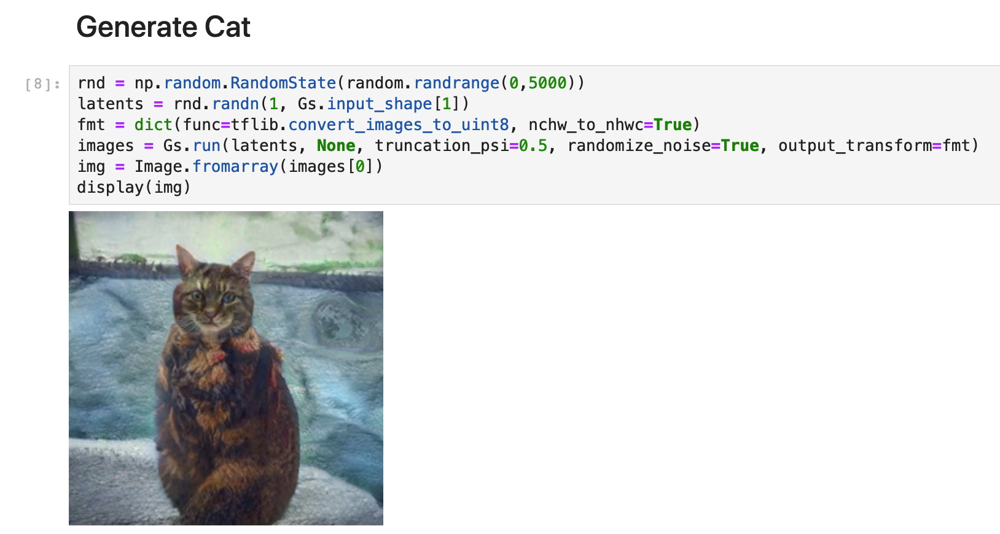
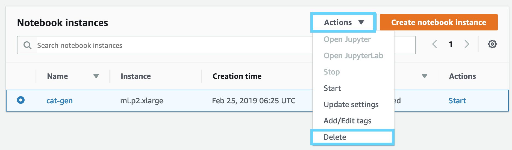
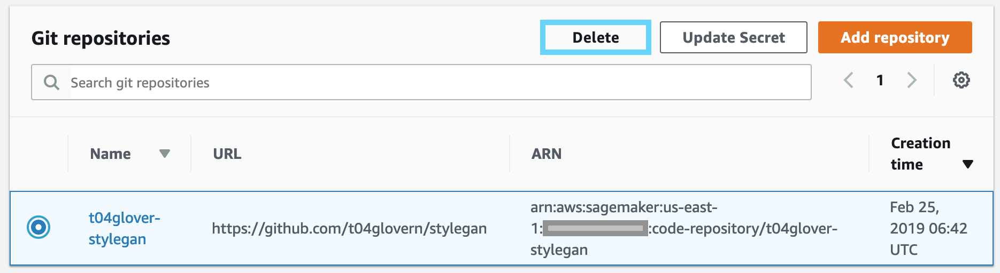

# These Cats Don't Exist

Generating Cat images using StyleGAN on AWS SageMaker. Developing a simple and repeatable Data Science pipeline for Generative Adversarial Network outputs


## Website

### Create Bucket

```bash
aws s3 mb s3://thesecatsdonotexist.com
```

### Copy in Files

```bash
aws s3 cp index.html s3://thesecatsdonotexist.com/index.html
```

## Generate the Cats

```bash
jupyter-notebook notebooks/catgen.ipynb
```

## StyleGAN Model Copy

Obtain the cat gen model from the original repository (or you can get it from my s3 bucket [https://s3.amazonaws.com/devopstar/resources/aws-catgen/models/karras2019stylegan-cats-256x256.pkl](https://s3.amazonaws.com/devopstar/resources/aws-catgen/models/karras2019stylegan-cats-256x256.pkl)

```bash
aws s3 mb s3://devopstar
aws s3 cp model/karras2019stylegan-cats-256x256.pkl s3://resources/aws-catgen/models/karras2019stylegan-cats-256x256.pkl
```

## AWS SageMaker Generate

**WARNING**: You will be paying > $2 per hour running this notebook. Ensure you delete it or turn it off when you aren't using it.

Create the SageMaker role that we'll attach to our SageMaker instance. Unfortunately since CloudFormation options for SageMaker do not allow us to attach Git repos as options yet.

```bash
aws cloudformation create-stack \
    --stack-name "cat-gen-sagemaker-role" \
    --template-body file://cloudformation/sagemaker_role.yaml \
    --parameters S3BucketName="devopstar"
    --capabilities CAPABILITY_IAM
```

Once the role has been created successfully, retrieve the ARN for the use in the steps to follow.

```bash
aws cloudformation describe-stacks --stack-name "cat-gen-sagemaker-role" \
    --query 'Stacks[0].Outputs[?OutputKey==`MLNotebookExecutionRole`].OutputValue' \
    --output text
```

It will look something like `arn:aws:iam::XXXXXXXXXXXX:role/cat-gen-sagemaker-role-ExecutionRole-PZL3SA3IZPSN`.

Next create a Code repository and pass it in the repo `https://github.com/t04glovern/stylegan`

``` bash
aws sagemaker create-code-repository \
    --code-repository-name "t04glover-stylegan" \
    --git-config '{"Branch":"master", "RepositoryUrl" : "https://github.com/t04glovern/stylegan" }'
```

Finally create the notebook instance ensuring you pass in the Role ARN from before, and the default code repository we just created.

```bash
aws sagemaker create-notebook-instance \
    --notebook-instance-name "cat-gen" \
    --instance-type "ml.p2.xlarge" \
    --role-arn "arn:aws:iam::XXXXXXXXXXXXX:role/cat-gen-sagemaker-role-ExecutionRole-PZL3SA3IZPSN" \
    --default-code-repository "t04glover-stylegan"
```

Once completed, open in JupyterLab



You should be presented with the StyleGAN repository that we set as the default when creating the repository. Open the catgen notebook



Select the kernel to use, in our case its `conda_tensorflow_p36`



Begin to execute the notebook using the controls at the top of the notebook, you might run into some issues when bringing in the role; I've found this to be a benign issue through.



Finally after loading in the Pickle, we generate cats by running the last section over and over again.



### Removing Resources

Due to costs being really high, we need to destory the resources when we aren't using them. Start by shutting down the notebook (you can also delete it if you want)

#### UI





#### CLI

```bash
aws sagemaker delete-notebook-instance \
    --notebook-instance-name "cat-gen"

aws sagemaker delete-code-repository \
    --code-repository-name "t04glover-stylegan"

aws cloudformation delete-stack \
    --stack-name "cat-gen-sagemaker-role"
```
